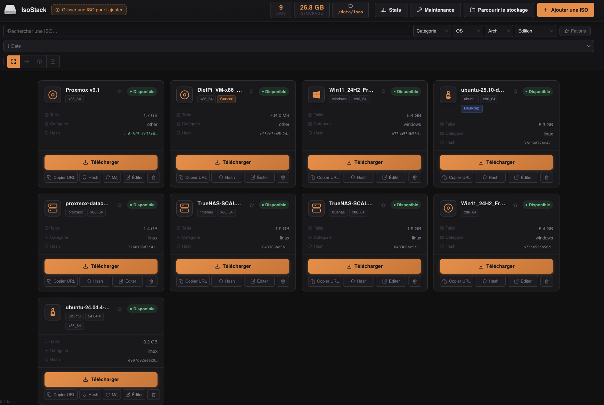
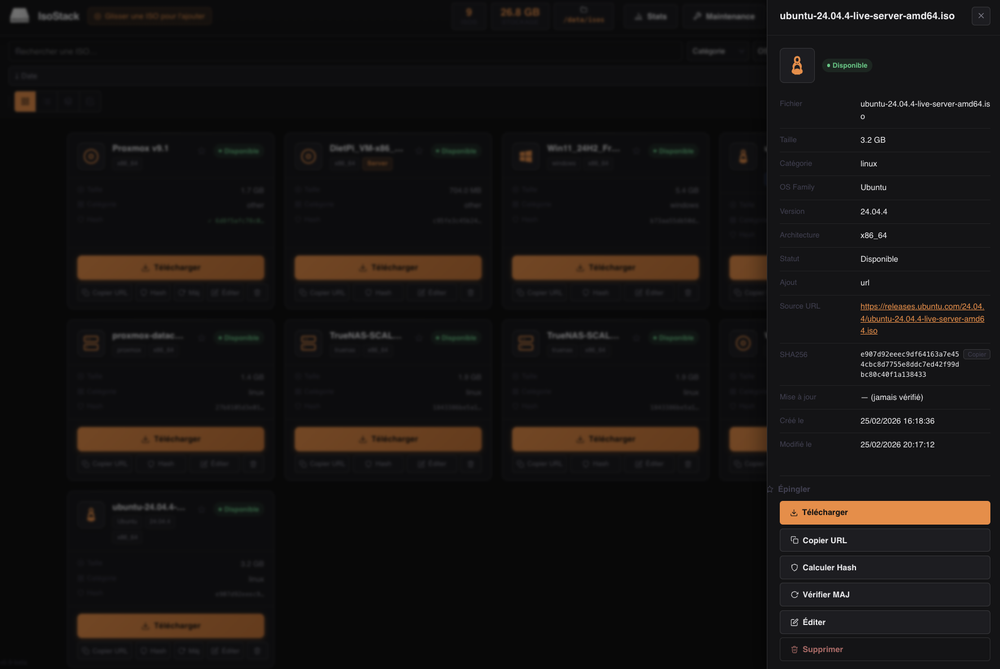
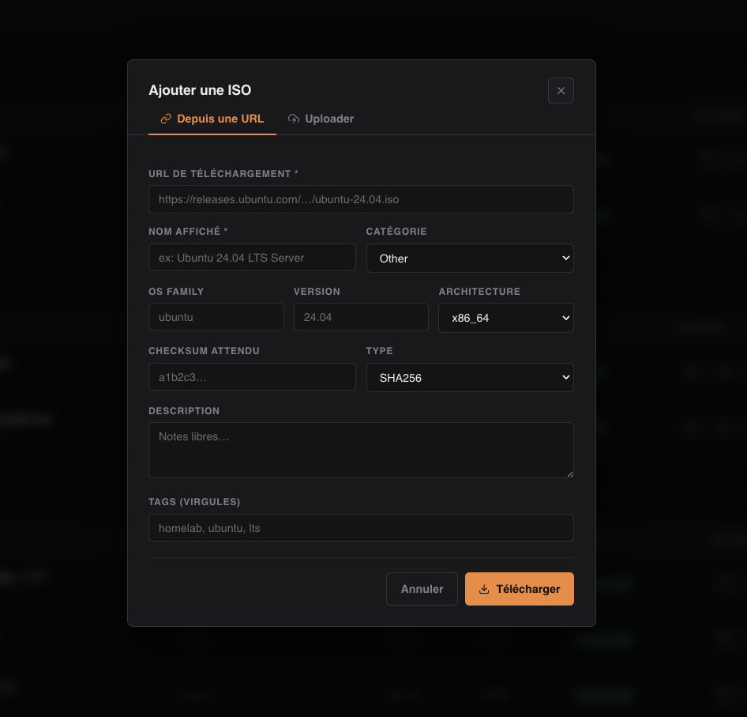
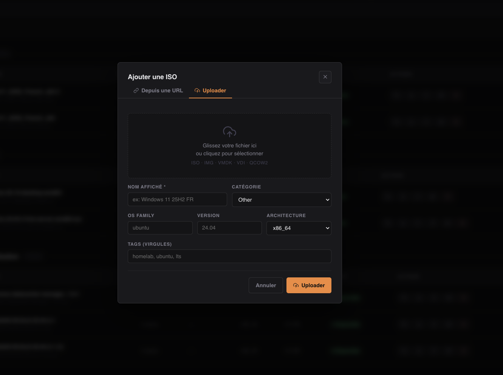

# IsoStack

Self-hosted web application to centralize, catalog and serve ISO files on a local network.


## Screenshots



<details>
<summary>More screenshots</summary>

**ISO detail panel**


**Add from URL**


**Upload a file**


**Library statistics**


</details>

## Features

- Catalog ISO files with metadata (OS, version, architecture, tags)
- Download ISOs directly from a URL (with progress tracking)
- Upload ISOs from your browser
- Auto-import files dropped manually in the storage folder
- SHA256 checksum verification
- Update check against source URL
- Direct HTTP file serving with Range request support (resumable downloads)
- Disk quota management
- Optional HTTP Basic authentication
- SQLite database — no external dependencies

## Stack

- Backend: Python 3.12 + FastAPI
- Frontend: HTML/CSS/JS vanilla + Jinja2
- Database: SQLite
- Container: Docker + Docker Compose

## Quick start

```bash
docker compose up -d
```

The interface is available at: `http://localhost:8585`

## Deploy on a VM or server

Copy only this `docker-compose.yml` to your machine — the ISO files are never included in the Docker image, they live in an external volume.

```yaml
services:
  isostack:
    image: kloudyman/isostack:latest
    container_name: isostack
    restart: unless-stopped
    ports:
      - "8585:8000"
    volumes:
      - ./data/isos:/data/isos
      - isostack-db:/data
    environment:
      - BASE_URL=http://YOUR_SERVER_IP:8585
      - MAX_CONCURRENT_DOWNLOADS=3
      - ISO_STORAGE_PATH=/data/isos
      - DB_PATH=/data/db.sqlite

volumes:
  isostack-db:
```

Then run:

```bash
# Install Docker (if not already installed)
curl -fsSL https://get.docker.com | sh

# Start IsoStack
docker compose up -d
```

> Replace `BASE_URL` with your actual server IP or hostname — this is used to generate direct download links.

## Map an existing ISO folder

```yaml
volumes:
  - /path/to/your/isos:/data/isos
```

## Change the listening port

```yaml
ports:
  - "9000:8000"
environment:
  - BASE_URL=http://localhost:9000
```

## Enable authentication

```yaml
environment:
  - AUTH_USERNAME=admin
  - AUTH_PASSWORD=yourpassword
```

Leave both empty (default) to disable authentication — suitable for a trusted local network.

## Environment variables

| Variable | Default | Description |
|----------|---------|-------------|
| `BASE_URL` | `http://localhost:8585` | Base URL used for direct download links |
| `ISO_STORAGE_PATH` | `/data/isos` | Path where ISO files are stored |
| `DB_PATH` | `/data/db.sqlite` | SQLite database path |
| `MAX_CONCURRENT_DOWNLOADS` | `3` | Max parallel downloads |
| `MAX_UPLOAD_SIZE_GB` | `0` | Max upload size in GB (0 = unlimited) |
| `AUTH_USERNAME` | *(empty)* | HTTP Basic auth username (disabled if empty) |
| `AUTH_PASSWORD` | *(empty)* | HTTP Basic auth password (disabled if empty) |
| `AUTO_IMPORT_ENABLED` | `true` | Auto-import files dropped in storage folder |
| `FILE_CHECK_INTERVAL` | `60` | Interval in seconds between storage scans |
| `MAX_DISK_USAGE_PCT` | `90` | Block uploads/downloads above this disk usage % (0 = disabled) |

## REST API

```
GET    /api/isos                    List all ISOs (filterable)
GET    /api/isos/{id}               Get ISO details
POST   /api/isos/from-url           Download ISO from URL
POST   /api/isos/upload             Upload ISO file
PUT    /api/isos/{id}               Update ISO metadata
DELETE /api/isos/{id}               Delete ISO
POST   /api/isos/{id}/verify        Re-verify checksum
POST   /api/isos/{id}/check-update  Check for update at source URL
GET    /api/isos/{id}/progress      Download progress
GET    /api/browse                  List files in storage folder
POST   /api/isos/import             Import file from storage into catalog
GET    /api/stats                   Storage statistics
GET    /api/system-info             System info (disk usage, ISO count)
GET    /files/{filename}            Direct file access (Range requests supported)
```

## Supported file formats

`.iso` `.img` `.vmdk` `.vdi` `.qcow2` `.raw` `.vhd` `.vhdx` `.ova` `.ovf` `.tar` `.gz` `.xz` `.zst`

## Roadmap

- [ ] English translation / i18n support
- [ ] Dark / light theme toggle
- [ ] Bulk import from storage
- [ ] Scheduled update checks
- [ ] Webhook notifications (download complete, update available)
- [ ] S3 / remote storage backend support
- [ ] Mobile-friendly UI improvements

## License

MIT
